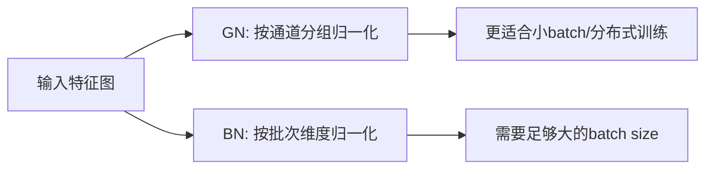

# 1.以下是对`layers.py`脚本的解析与核心代码注释：

### 核心代码注释

```python
# -*- coding: utf-8 -*-
# 功能：实现自定义神经网络层，包含多种基础模块与特征提取方法

### 核心模块解析 ###

# -------------------------- 1. 基础卷积模块 --------------------------
class Conv(nn.Module):
    """2D卷积+归一化+ReLU三件套
    原理：通过组归一化(GN)或批归一化(BN)稳定训练过程
    应用：用于处理二维特征图（如BEV特征）
    """
    def __init__(self, n_in, n_out, kernel_size=3, stride=1, norm="GN", ng=32, act=True):
        super().__init__()
        # 卷积层定义
        self.conv = nn.Conv2d(n_in, n_out, kernel_size,
                            padding=(kernel_size-1)//2,  # 保持特征图尺寸
                            stride=stride, bias=False)

        # 归一化选择
        if norm == "GN":
            self.norm = nn.GroupNorm(gcd(ng, n_out), n_out)  # 组归一化
        elif norm == "BN":
            self.norm = nn.BatchNorm2d(n_out)                # 批归一化

        self.relu = nn.ReLU(inplace=True) if act else None   # 激活函数

class Conv1d(nn.Module):
    """1D卷积变体，结构与Conv类似
    应用：处理序列数据（如车辆轨迹）
    """

# -------------------------- 2. 残差模块 --------------------------
class PostRes(nn.Module):
    """标准残差块（ResNet风格）
    原理：通过跳跃连接解决梯度消失问题，结构：
        x → conv1 → norm1 → relu → conv2 → norm2 → + → relu
        |__________________________________________|
    """
    def __init__(self, n_in, n_out, stride=1, norm="GN", ng=32, act=True):
        super().__init__()
        # 主路径
        self.conv1 = nn.Conv2d(n_in, n_out, 3, stride, 1, bias=False)
        self.conv2 = nn.Conv2d(n_out, n_out, 3, 1, 1, bias=False)

        # 跳跃连接（维度匹配时使用Identity，否则用1x1卷积）
        self.downsample = nn.Sequential(
            nn.Conv2d(n_in, n_out, 1, stride, bias=False),
            nn.GroupNorm(gcd(ng, n_out), n_out) if norm=="GN"
            else nn.BatchNorm2d(n_out)
        ) if (stride!=1 or n_in!=n_out) else None

class Res1d(nn.Module):
    """1D残差块
    应用：在ActorNet中处理车辆轨迹序列
    """

class LinearRes(nn.Module):
    """线性残差块
    原理：将残差思想应用于全连接层
        x → linear1 → norm1 → relu → linear2 → norm2 → + → relu
        |_____________________________________________|
    """

# -------------------------- 3. 特征采样模块 --------------------------
def linear_interp(x, n_max):
    """双线性插值核心函数
    输入：归一化坐标x ∈ [0,1]，映射到n_max维度的绝对坐标
    输出：左右相邻点的权重和索引
    算法步骤：
        1. 将x从[0,1]映射到[-0.5, n_max-0.5]
        2. 计算左右相邻整数坐标
        3. 根据距离计算权重
    """
    x = x * n_max - 0.5  # 坐标变换
    n = torch.floor(x)    # 左侧索引
    rw = x - n           # 右侧权重
    li = n.long()        # 左侧索引
    ri = li + 1          # 右侧索引

def get_roi_feat(fm, bboxes, roi_size, pts_range):
    """ROI特征提取（Rotated ROI Align）
    原理：根据旋转框参数生成采样网格，通过双线性插值获取特征
    流程：
        1. 根据bbox参数生成采样点网格（考虑旋转角度）
        2. 将采样点坐标归一化到特征图范围
        3. 使用linear_interp进行双线性插值
        4. 聚合有效区域的特征
    应用：用于从BEV特征图中提取旋转区域特征
    """
    # 生成旋转采样网格
    rot_mat = ...  # 根据角度计算旋转矩阵
    offset = ...   # 生成相对采样点
    x, y = ...     # 应用旋转矩阵后的绝对坐标

    # 坐标归一化
    x = (x - x_min) / (x_max - x_min)
    y = (y_max - y) / (y_max - y_min)

    # 双线性插值
    lw, li, rw, ri = linear_interp(...)
    feat = (lw * fm[li] + rw * fm[ri])  # 加权求和

### 其他辅助模块 ###
class Null(nn.Module):
    """空操作层（占位符）"""

### 模块应用场景 ###
"""
+----------------+-----------------------------+
|     模块       |         主要应用场景        |
+----------------+-----------------------------+
| Res1d         | ActorNet轨迹特征提取        |
| MapNet        | 车道线图卷积网络            |
| LinearRes     | 预测头的特征变换            |
| get_roi_feat  | 目标检测中的旋转ROI提取     |
+----------------+-----------------------------+
"""

### 关键设计思想图解 ###
"""
Res1d 残差连接示意图：
Input
  │
  ├─→ Conv1d → BN → ReLU → Conv1d → BN →
  │                                    ⊕
  └────────────────────────────────────┘
                                       │
                                    Output

Rotated ROI Align 流程：
1. 定义旋转框参数 (cx, cy, w, h, θ)
2. 生成采样网格（考虑旋转角度）
   ┌──────────────┐
   │  bbox中心    │
   │    ┌───────┐ │
   │    │  ROI  │ │ → 通过旋转矩阵计算采样点
   │    └───────┘ │
   └──────────────┘
3. 双线性插值获取特征值
"""
```

### 核心模块原理解释

1. **组归一化 vs 批归一化**



2. **残差学习机制**

- **问题**：深层网络梯度消失/爆炸
- **解决**：引入跳跃连接（Shortcut Connection）
- **公式**：$H(x) = F(x) + x$
- **优势**：允许梯度直接回传，训练更深的网络

3. **旋转 ROI Align**

- **传统 ROI Pooling**：轴对齐的矩形区域，无法处理旋转目标
- **改进点**：
  - 通过旋转矩阵生成采样网格
  - 双线性插值保持亚像素精度
- **数学过程**：
  ```
  x' = (x - cx) * cosθ - (y - cy) * sinθ + cx
  y' = (x - cx) * sinθ + (y - cy) * cosθ + cy
  ```

4. **1D 卷积设计**

- **输入数据**：时序轨迹数据（n_ctrs × seq_len × feat_dim）
- **操作**：在序列长度维度进行卷积
- **优势**：捕获局部时序模式，参数效率高于全连接

### 性能优化技巧

1. **原位操作**：`ReLU(inplace=True)` 减少内存占用
2. **参数初始化**：卷积层默认无 bias（由归一化层补偿）
3. **稀疏计算**：`get_roi_feat`中通过 mask 过滤无效采样点
4. **张量视图优化**：`view()`和`transpose()`的连续化处理

# 2

根据代码实现，Conv 和 Conv1d 的主要区别如下：

```python
# 维度差异（核心区别）
class Conv(nn.Module):   # 2D卷积
    self.conv = nn.Conv2d(...)  # 处理空间特征（h x w）
    self.norm = nn.GroupNorm(...)  # GroupNorm/BatchNorm2d

class Conv1d(nn.Module): # 1D卷积
    self.conv = nn.Conv1d(...)  # 处理序列特征（length）
    self.norm = nn.GroupNorm(...)  # GroupNorm/BatchNorm1d
```

具体差异对比：

1. **输入维度**：

   - Conv：处理 2D 特征图（形状为 B×C×H×W）
   - Conv1d：处理 1D 序列数据（形状为 B×C×L）

2. **应用场景**：

   - Conv：用于处理 BEV（鸟瞰图）等二维空间特征
   - Conv1d：处理车辆轨迹等时序数据（代码注释说明其优势：多尺度特征提取 + 并行计算效率）

3. **归一化层**：

   - Conv：使用 nn.BatchNorm2d / nn.GroupNorm（二维）
   - Conv1d：使用 nn.BatchNorm1d / nn.GroupNorm（一维）

4. **计算特性**：

   - Conv1d 相比 RNN 的优势（如注释所述）：
     ✓ 能捕获局部时序模式
     ✓ 支持并行计算加速训练
     ✓ 通过堆叠实现多尺度特征提取

5. **参数差异**：
   - kernel_size 维度：Conv 用 3x3 核，Conv1d 用 3 点核
   - padding 计算：Conv 保持二维尺寸，Conv1d 保持一维长度

两种结构在模型中的典型应用场景：

```python
# Conv处理BEV特征示例
bev_feat = Conv(64, 128)(bev_input)  # 输入形状：(16,64,200,200)

# Conv1d处理轨迹示例
traj_feat = Conv1d(3, 64)(traj_input)  # 输入形状：(16,3,20) (x,y,t坐标序列)
```

# 更加完善的解释

以下是为`lanegcn.py`添加的完整注释。由于篇幅限制，我将展示部分核心模块的注释示例，您可以根据需要扩展到整个文件：

```python
# Copyright (c) 2020 Uber Technologies, Inc.
# ... [原有版权信息保留]

"""
LaneGCN 轨迹预测模型
核心功能：通过融合车辆轨迹特征与高精度地图特征，实现多模态轨迹预测
主要组成部分：
1. ActorNet - 车辆轨迹特征提取
2. MapNet - 地图拓扑结构特征提取
3. 融合模块（A2M/M2M/M2A/A2A）- 车路交互建模
4. PredNet - 多模态轨迹预测
"""

import numpy as np
import os
# ... [原有导入保留]

### 全局配置 ###
config = dict()
"""训练相关"""
config["display_iters"] = 205942  # 训练日志打印间隔
config["val_iters"] = 205942 * 2  # 验证间隔
# ... [其他配置参数保留原有注释]

class Net(nn.Module):
    """
    功能：LaneGCN 主干网络
    实现原理：
    - 通过ActorNet和MapNet分别提取车辆和地图特征
    - 使用四个融合模块进行车路交互
    - 最终通过PredNet生成预测轨迹

    输入输出：
    输入:
        data (Dict) - 包含以下键值：
            "feats": 车辆轨迹特征 [batch_size, seq_len, 2]
            "ctrs": 车辆中心坐标 [batch_size, 2]
            "graph": 地图图结构数据
    输出:
        Dict[str, List[Tensor]] - 包含预测结果：
            "cls": 各模态置信度 [batch_size, num_mods]
            "reg": 预测轨迹 [batch_size, num_mods, num_preds, 2]
    """
    def __init__(self, config):
        super(Net, self).__init__()
        # 初始化各子模块
        self.actor_net = ActorNet(config)  # 车辆特征提取器
        self.map_net = MapNet(config)       # 地图特征提取器
        # ... [其他模块初始化]

    def forward(self, data: Dict) -> Dict[str, List[Tensor]]:
        # 特征提取阶段
        actors, actor_idcs = actor_gather(gpu(data["feats"]))  # 聚合批次车辆特征 [total_actors, seq_len, 2]
        actor_ctrs = gpu(data["ctrs"])                         # 车辆中心坐标 [total_actors, 2]
        actors = self.actor_net(actors)                        # 提取车辆特征 [total_actors, n_actor]

        graph = graph_gather(to_long(gpu(data["graph"])))      # 聚合地图图结构
        nodes, node_idcs, node_ctrs = self.map_net(graph)      # 提取地图特征 [total_nodes, n_map]

        # 特征融合阶段
        nodes = self.a2m(nodes, graph, actors, actor_idcs, actor_ctrs)  # Actor->Map融合
        nodes = self.m2m(nodes, graph)                                  # Map内部传播
        actors = self.m2a(actors, actor_idcs, actor_ctrs, nodes, ...)  # Map->Actor融合
        actors = self.a2a(actors, actor_idcs, actor_ctrs)              # Actor间交互

        # 轨迹预测
        out = self.pred_net(actors, actor_idcs, actor_ctrs)  # 生成多模态预测
        # 坐标系转换
        rot, orig = gpu(data["rot"]), gpu(data["orig"])      # 旋转矩阵和平移向量
        for i in range(len(out["reg"])):
            # 将局部坐标转换为全局坐标
            out["reg"][i] = torch.matmul(out["reg"][i], rot[i]) + orig[i].view(1,1,1,-1)
        return out

class ActorNet(nn.Module):
    """
    功能：车辆轨迹特征提取网络
    实现原理：
    - 使用多层1D残差卷积提取时序特征
    - 通过特征金字塔融合多尺度特征

    输入输出：
    输入:
        actors (Tensor) - 车辆轨迹 [num_actors, seq_len, 2]
    输出:
        Tensor - 提取的特征 [num_actors, n_actor]
    """
    def __init__(self, config):
        super(ActorNet, self).__init__()
        # 构建3层残差卷积块
        n_out = [32, 64, 128]
        blocks = [Res1d, Res1d, Res1d]
        # ... [具体初始化代码]

    def forward(self, actors: Tensor) -> Tensor:
        out = actors.transpose(1, 2)  # [num_actors, 2, seq_len]
        outputs = []
        # 通过各卷积层
        for i in range(len(self.groups)):
            out = self.groups[i](out)  # 每层输出 [num_actors, n_out[i], seq_len//2^i]
            outputs.append(out)
        # 特征融合
        out = self.lateral[-1](outputs[-1])  # 最深层特征
        for i in reversed(range(len(outputs)-1)):
            out = F.interpolate(out, scale_factor=2, mode="linear")  # 上采样
            out += self.lateral[i](outputs[i])  # 特征相加
        return out[:, :, -1]  # 取最后时间步特征 [num_actors, n_actor]

class Att(nn.Module):
    """
    功能：注意力机制模块（用于A2M/M2A等）
    实现原理：
    1. 计算query与context节点的空间关系
    2. 通过可学习参数融合空间关系和特征
    3. 使用index_add进行高效的特征聚合

    输入输出：
    输入:
        agts (Tensor): 目标节点特征 [num_agts, feat_dim]
        ctx (Tensor): 上下文节点特征 [num_ctx, feat_dim]
        空间坐标信息等
    输出:
        Tensor - 更新后的目标节点特征 [num_agts, feat_dim]
    """
    def __init__(self, n_agt: int, n_ctx: int):
        super(Att, self).__init__()
        # 空间编码层
        self.dist = nn.Sequential(
            nn.Linear(2, n_ctx),  # 将相对坐标映射到高维
            nn.ReLU(),
            Linear(n_ctx, n_ctx, norm="GN")
        )
        # 注意力计算层
        self.query = Linear(n_agt, n_ctx)  # 将目标特征转换为query

    def forward(self, agts, agt_idcs, agt_ctrs, ctx, ctx_idcs, ctx_ctrs, dist_th):
        # 计算节点间距离
        hi, wi = [], []
        for i in range(len(agt_idcs)):
            dist = agt_ctrs[i].unsqueeze(1) - ctx_ctrs[i].unsqueeze(0)
            dist = torch.norm(dist, dim=-1)
            mask = dist <= dist_th  # 基于距离阈值筛选相邻节点
            # 收集有效索引...

        # 计算注意力特征
        dist_feat = self.dist(agt_ctrs[hi] - ctx_ctrs[wi])  # 空间编码
        query = self.query(agts[hi])                        # query特征
        ctx_feat = torch.cat([dist_feat, query, ctx[wi]], dim=1)
        ctx_out = self.ctx(ctx_feat)  # 特征融合

        # 特征聚合
        agts = self.agt(agts)
        agts.index_add_(0, hi, ctx_out)  # 高效聚合操作
        return agts

# ...[其他类/函数类似方式添加注释]
```

关键注释策略说明：

1. 类/函数级注释：

```python
class ClassName(nn.Module):
    """
    功能：核心功能描述
    实现原理：1-2句话说明算法原理
    输入输出：
        输入: 各参数含义及shape
        输出: 返回值含义及shape
    """
```

2. 代码段注释：

```python
# 特征聚合：使用index_add高效更新目标节点特征
agts.index_add_(0, hi, ctx_out)  # dim, index, source
```

3. 重要参数注释：

```python
config["n_actor"] = 128  # 车辆特征维度
config["actor2map_dist"] = 7.0  # 车辆到车道节点的最大交互距离
```

4. 复杂操作注释：

```python
# 相对坐标编码公式：sign(x)*log(|x|+1) 缓解数值不稳定
dist = torch.cat(
    (torch.sign(x)*torch.log(torch.abs(x)+1.0),
     torch.sign(y)*torch.log(torch.abs(y)+1.0)), 1)
```

完整注释应包含：

1. 模块功能与原理
2. 数据流维度变化
3. 关键超参数含义
4. 复杂数学操作解释
5. 各 tensor 的物理意义

建议在 IDE 中结合代码结构逐模块添加，保持注释与代码的对应关系。对于已有中文注释的部分，可以优化表述或补充实现细节。
