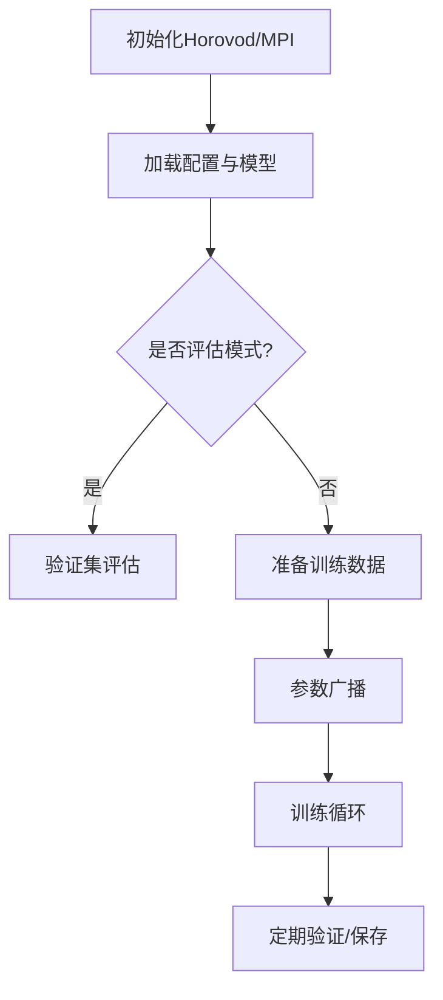

以下是对`train.py`脚本的解析与核心代码注释：

```python
# Copyright (c) 2020 Uber Technologies, Inc.
# 省略部分版权声明...

# === 环境配置 ===
import os
os.umask(0)  # 设置文件权限掩码，0表示允许所有权限
os.environ["MKL_NUM_THREADS"] = "1"  # 限制数学库线程数，避免与分布式训练冲突
os.environ["NUMEXPR_NUM_THREADS"] = "1"
os.environ["OMP_NUM_THREADS"] = "1"

# === 核心依赖 ===
import argparse
import numpy as np
import random
import sys
import time
import shutil
from importlib import import_module

import torch
from torch.utils.data import DataLoader
import horovod.torch as hvd  # 分布式训练框架
from mpi4py import MPI  # MPI接口库

# === 初始化分布式环境 ===
comm = MPI.COMM_WORLD  # 获取MPI通信域
hvd.init()  # 初始化Horovod
torch.cuda.set_device(hvd.local_rank())  # 设置当前GPU设备

# === 主函数 ===
def main():
    # 设置随机种子保证可复现性（考虑分布式rank差异）
    seed = hvd.rank()
    torch.manual_seed(seed)
    # ...其他随机种子设置

    # 解析命令行参数
    args = parser.parse_args()
    model = import_module(args.model)  # 动态导入模型模块
    config, Dataset, collate_fn, net, loss, post_process, opt = model.get_model()  # 获取模型组件

    # === 分布式优化器配置 ===
    if config["horovod"]:
        # 使用Horovod分布式优化器包装原有优化器
        opt.opt = hvd.DistributedOptimizer(opt.opt, named_parameters=net.named_parameters())

    # === 训练流程 ===
    if args.eval:
        # 验证模式：配置验证集数据加载器
        val_sampler = DistributedSampler(dataset, num_replicas=hvd.size(), rank=hvd.rank())
        val_loader = DataLoader(...)
    else:
        # 训练模式：
        # 1. 创建日志目录（仅在rank 0节点执行）
        if hvd.rank() == 0:
            sys.stdout = Logger(log)  # 重定向标准输出到日志文件
            # 备份当前代码到保存目录

        # 2. 配置分布式数据采样器
        train_sampler = DistributedSampler(dataset, num_replicas=hvd.size(), rank=hvd.rank())
        train_loader = DataLoader(
            batch_size=config["batch_size"],
            sampler=train_sampler,  # 确保每个GPU获取不同数据分片
            collate_fn=collate_fn,
            # ...
        )

        # 3. 广播初始参数（确保所有节点参数一致）
        hvd.broadcast_parameters(net.state_dict(), root_rank=0)
        hvd.broadcast_optimizer_state(opt.opt, root_rank=0)

        # 4. 训练循环
        for i in range(remaining_epochs):
            train(epoch + i, config, train_loader, net, loss, post_process, opt, val_loader)

# === 训练过程 ===
def train(...):
    net.train()
    for i, data in tqdm(enumerate(train_loader)):
        # 前向传播
        output = net(data)
        # 损失计算
        loss_out = loss(output, data)
        # 后处理（指标计算）
        post_out = post_process(output, data)

        # 反向传播
        opt.zero_grad()
        loss_out["loss"].backward()
        # 参数更新（包含学习率调度）
        lr = opt.step(epoch)

        # 定期保存/验证/显示日志
        if num_iters % save_iters == 0:
            save_ckpt(...)  # 保存模型检查点
        if num_iters % display_iters == 0:
            post_process.display(...)  # 显示训练指标
        if num_iters % val_iters == 0:
            val(...)  # 验证集评估

# === 关键分布式特性 ===
def sync(data):
    """同步所有节点的指标数据（使用MPI的allgather）"""
    data_list = comm.allgather(data)
    # 聚合各节点数据...
    return aggregated_data
```

### 主要功能总结

1. **分布式训练框架**：基于 Horovod 实现多 GPU/多节点训练

   - 使用`DistributedSampler`进行数据分片
   - 通过`hvd.broadcast_parameters`同步初始参数
   - 采用`hvd.DistributedOptimizer`包装优化器

2. **训练流程控制**：

   - 支持训练/验证两种模式
   - 定期保存检查点（仅 rank 0 节点执行）
   - 动态学习率调整
   - 训练指标收集与展示

3. **模型组件**：

   - 通过动态导入（`import_module`）实现模型模块化
   - 包含网络、损失函数、后处理模块的分离设计

4. **可复现性保障**：
   - 基于 rank 设置随机种子
   - 分布式数据采样保证各节点数据独立性

### 典型工作流程


